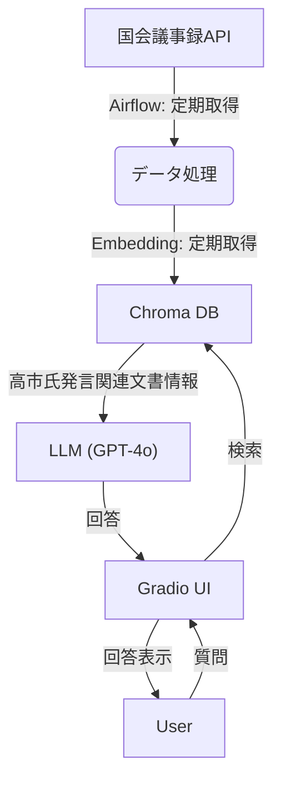

# 高市早苗 国会発言検索チャットボット

国会議事録APIから発言データを取得し、RAG（Retrieval-Augmented Generation）で高市早苗氏の発言を検索できるチャットボットです。


## ■ 機能

- **国会議事録API連携**: 2023年以降の本会議・予算委員会・総務委員会の発言を自動取得
- **差分更新**: 取得済みデータとの重複を避けて効率的に更新
- **ベクトル検索**: Chroma DBによる高速な類似検索
- **対話型UI**: Gradioによるチャットインターフェース
- **定期更新**: Airflowによる自動パイプライン

## ■ Live Demo

**デモサイト**: <a href="https://takaichi-speech-rag.fly.dev/" target="_blank">https://takaichi-speech-rag.fly.dev/</a> <br>
>　※アイドル状態からの初回アクセス時は、アプリの起動に約30秒程度かかります。しばらくお待ちください。

## ■ システム構成図



## ■ 構成
```
rag-demo/
├── dags/                        # Airflow DAG
│   └── embedding_update_dag.py
├── data/                        # データ格納
│   └── diet_speeches_sample.jsonl
├── src/
│   ├── app.py                   # FastAPI サーバー
│   ├── get_diet_speeches.py     # 国会議事録取得
│   ├── update_vectorstore.py    # ベクトルDB更新
│   ├── rag_engine.py            # RAG検索エンジン
│   ├── ui_gradio.py             # Gradio UI
│   └── utils.py                 # ユーティリティ
├── docker-compose.yml
├── Dockerfile                   # Gradio UI用
├── Dockerfile.airflow           # Airflow用
├── requirements.txt
└── requirements.lock            # バージョン固定
```

## ■ セットアップ

### 1. リポジトリをクローン
```bash
git clone https://github.com/your-username/rag-demo.git
cd rag-demo
```

### 2. 環境変数の設定
```bash
cp .env.example .env
```

`.env` を編集して `OPENAI_API_KEY` を設定：
```
OPENAI_API_KEY=sk-xxxxxxxxxxxxxxxxxxxxxxxx
```

### 3. 仮想環境の作成（ローカル実行の場合）
```bash
python -m venv .venv
.venv\Scripts\activate  # Windows
# source .venv/bin/activate  # Mac/Linux

pip install -r requirements.txt
```

### 4. データの準備

**サンプルデータで試す場合:**
```bash
mv data/diet_speeches_sample.jsonl data/diet_speeches.jsonl
python -m src.update_vectorstore
```

**本番データを取得する場合:**
```bash
python -m src.get_diet_speeches
python -m src.update_vectorstore
```

## ■ 起動方法

### ローカル実行

**Gradio UI:**
```bash
python -m src.ui_gradio
# http://localhost:7860 にアクセス
```

**FastAPI:**
```bash
python -m src.app
# http://localhost:8000/docs でAPIドキュメント
```

### Docker Compose
```bash
docker-compose up -d
```

| サービス | URL | 認証 |
|---------|-----|------|
| Gradio UI | http://localhost:7860 | なし |
| Airflow | http://localhost:8080 | admin / admin |

## ■ Airflow設定

毎日自動で以下のタスクを実行：

1. **fetch_diet_speeches** - 国会議事録APIから差分データを取得
2. **update_vectorstore** - ベクトルDBを再構築

スケジュール: 毎日 11:08 JST（UTC 02:08）

## ■ 利用アプリケーション

| カテゴリ | アプリケーション |
|---------|------|
| LLM | OpenAI GPT-4o-mini |
| Embedding | intfloat/multilingual-e5-small |
| Vector DB | Chroma |
| Framework | LangChain |
| UI | Gradio |
| API | FastAPI |
| Orchestration | Apache Airflow |
| Container | Docker |

## ■ API使用例
```bash
curl -X POST http://localhost:8000/ask \
  -H "Content-Type: application/json" \
  -d '{"question": "安全保障について", "top_k": 10}'
```

## ■ ライセンス

MIT License
